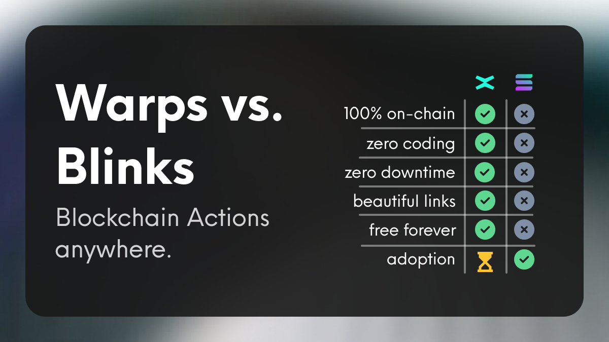

# Warps vs. Blinks

Warps are a revolutionary protocol on the Multiversᕽ blockchain built from the ground up with crypto-native foundations. Here's why Warps stand out:

- **Crypto-Native**: Fully on-chain using Inscriptions, ensuring enhanced security and permanence—what you see is what you get, forever.
- **No-Code Solution**: Create Warps without writing a single line of code, unlike Blinks, which require an API with significant coding efforts.
- **Unmatched Availability**: Warps are always accessible as long as the blockchain is operational, unlike Blinks, which depend on API uptime of private servers.
- **Beautiful, Shareable Links**: Enjoy elegant on-chain aliases (e.g., usewarp.to/create-token) instead of cryptic URLs.
- **Free Forever**: Enjoy using Warps without the burden of monthly server costs, unlike Blinks.
- **Developer-Friendly**: Utilize standardized JSON structures for quick and easy creation and manipulation of Warps.
- **Enhanced Functionality**: Think of MultiversX Warps as a combination of Solana Actions and Blinks.

